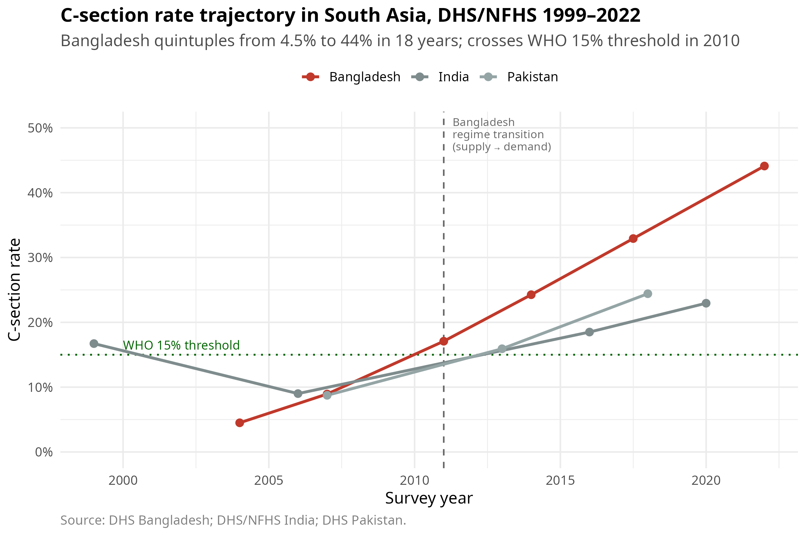

# csection-paradox-bd

**A reproducible identification audit of C-section's effect on under-five mortality in Bangladesh, 2004–2022.**

Bangladesh's C-section rate quintupled from 4.5% to 44% in eighteen years. The same Demographic and Health Survey data tells a contradictory story about whether C-sections reduce or increase child mortality, depending on which wave you read. This repository builds the causal estimator that *would* answer the question, then runs the diagnostic chain that demonstrates why the answer cannot be trusted — and what to do about it.



---

## Headline finding

A recursive bivariate probit on Bangladesh DHS waves 2004, 2011, 2017–18, 2022 estimates the following wave-stratified average treatment effect of C-section on under-24-month mortality:

| Wave | N | C-section ATE (pp) | 95% cluster-bootstrap CI (pp) | Significant? |
|---|---|---|---|---|
| 2004 | 3,478 | +0.04 | [−1.32, +1.40] | no |
| 2011 | 4,661 | +0.56 | [−0.76, +1.88] | no |
| 2017–18 | 4,793 | +1.14 | [−0.63, +2.91] | no |
| **2022** | **4,671** | **−1.51** | **[−2.83, −0.19]** | **yes (α=0.05)** |

Read naively, the 2022 row is a statistically significant **protective** effect.

Three independent diagnostic tests reject the identifying assumptions:

1. **Cross-instrument placebo (Swanson & Hernán 2013):** every IV → wrong-treatment regression is significant at p < 10⁻⁷ in 8 of 8 cells. The exclusion restriction is violated.
2. **Wooldridge-style endogeneity test (Terza 2018, 2SRI):** for C-section in all four waves, the residual coefficient p-value is > 0.19. The data cannot detect the endogeneity the RBVP was built to correct.
3. **Copula sensitivity (McGovern 2015; Klein 2019):** 5 of 8 ATEs flip sign across Gaussian, Frank, and Clayton dependence structures.

Phase D modern inference layers four more sensitivity checks ([scripts/50_phase_d_modern/](scripts/50_phase_d_modern/)):

- **E-value (VanderWeele & Ding 2017):** 2022 CI-based E-value = 1.25 → a confounder with RR ≥ 1.25 for both treatment and outcome would nullify.
- **Cinelli-Hazlett sensemakr (2020):** 2022 robustness value = 7.2% (4.6% at α=0.05). A confounder explaining ~5% of variance in both directions overturns the result.
- **Acerenza, Bartalotti & Kédagni (2023):** simplified bootstrap of the 6 testable inequalities. Inequality #5 (Φ(min(β+α, β)) ≤ inf E[Y|Z]) is rejected at α=0.05 — formal evidence the bivariate probit identifying assumptions do not hold.
- **Predetermined Chow test at 2011:** F = 246, p = 0.004 — the supply→demand regime break is structurally visible despite T=6.

The model recovers a point estimate. The diagnostics demonstrate the estimate cannot be interpreted causally. **The paper's headline is not "C-section reduces mortality" — it is "this is what an identification-rejected model looks like, and here is the pivot."**

For the narrative version, see [docs/BRIEF.md](docs/BRIEF.md).

---

## Three reader paths

| If you are a... | Start here | Then | Then |
|---|---|---|---|
| **Social scientist** working on observational maternal-health data | [docs/BRIEF.md §5–§7](docs/BRIEF.md) (regime transition, pivots, policy ask) | [scripts/20_descriptive/](scripts/20_descriptive/) (the regime-shift story in 5 figures) | [scripts/50_phase_d_modern/54_chow_descriptive_break.R](scripts/50_phase_d_modern/54_chow_descriptive_break.R) |
| **Economist / IV methodologist** | [docs/BRIEF.md §2.1, §3, §4](docs/BRIEF.md) (placebo, Duflo framing, LATE) | [scripts/40_causal_main/44_iv_validity_tests.R](scripts/40_causal_main/44_iv_validity_tests.R) (placebo + balance + reduced-form) | [scripts/30_spatial/](scripts/30_spatial/) (spatial multilevel models) |
| **Statistician / identification theorist** | [docs/BRIEF.md §1–§2 + Reading list](docs/BRIEF.md) | [scripts/40_causal_main/](scripts/40_causal_main/) (the 5 fixed scripts) and [scripts/50_phase_d_modern/](scripts/50_phase_d_modern/) | [docs/METHODOLOGY_MAP.md](docs/METHODOLOGY_MAP.md) for the output→reference map |

---

## Quickstart

```bash
git clone https://github.com/moccaram/csection-paradox-bd.git
cd csection-paradox-bd

# Install R deps (one-time)
Rscript scripts/00_setup/install_packages.R

# Reproduce the descriptive figures (no DHS access required — uses committed aggregates)
Rscript scripts/20_descriptive/21_csec_trajectory.R
Rscript scripts/20_descriptive/22_who_threshold_crossing.R
Rscript scripts/20_descriptive/23_sector_decomposition.R
Rscript scripts/20_descriptive/24_wealth_gradient.R
Rscript scripts/20_descriptive/25_mortality_trends.R

# Reproduce Phase D (no DHS access required — uses committed processed data)
Rscript scripts/50_phase_d_modern/51_evalue.R
Rscript scripts/50_phase_d_modern/54_chow_descriptive_break.R
Rscript scripts/50_phase_d_modern/52_sensemakr.R
Rscript scripts/50_phase_d_modern/53_acerenza_inequalities.R
```

To reproduce the full causal pipeline from raw DHS microdata, see [docs/REPLICATION_GUIDE.md](docs/REPLICATION_GUIDE.md).

---

## Repository navigation

| Path | What's inside |
|---|---|
| [docs/](docs/) | The narrative brief, methodology map, pipeline graph, audit log, full changelog |
| [data/processed/](data/processed/) | Committed aggregate CSVs (descriptive trajectories, threshold years, sector decomposition, wealth gradient, mortality estimates) and the labelled master input RDS |
| [data/spatial/](data/spatial/) | Bangladesh DHS GPS clusters merged with Malaria Atlas travel times (RDS) |
| [data/raw/](data/raw/) | (gitignored) Raw DHS microdata — populated by user via `scripts/10_download/` |
| [scripts/00_setup/](scripts/00_setup/) | Package installation |
| [scripts/10_download/](scripts/10_download/) | DHS API + Malaria Atlas Project download wrappers |
| [scripts/20_descriptive/](scripts/20_descriptive/) | 5 polished plotting scripts for the regime-shift narrative |
| [scripts/30_spatial/](scripts/30_spatial/) | Bangladesh spatial pipeline: GPS merge, travel-time extraction, multilevel models, regime-shift heatmap |
| [scripts/40_causal_main/](scripts/40_causal_main/) | The 5 RBVP / 2SRI / IV-validity / copula / Conley scripts (A1–A14 fixed) |
| [scripts/50_phase_d_modern/](scripts/50_phase_d_modern/) | E-value + sensemakr + Acerenza + Chow |
| [scripts/99_appendix/](scripts/99_appendix/) | India and Pakistan multi-country extensions |
| [outputs/](outputs/) | All CSV results, mirrored by script subfolder |
| [figures/](figures/) | Publication-quality PNG figures, including the 9 main + Phase D set |
| [references/](references/) | BibTeX of all citations |

---

## What the diagnostics produced

The 9 main figures, in narrative order:

1. [`01_csec_trajectory.png`](figures/01_csec_trajectory.png) — South Asia C-section trajectories with WHO 15% threshold
2. [`02_who_threshold_crossed.png`](figures/02_who_threshold_crossed.png) — Bangladesh threshold crossing years (15% in 2010, 30% in 2016, 40% in 2020)
3. [`03_sector_decomposition.png`](figures/03_sector_decomposition.png) — Private sector dominates the C-section surge
4. [`04_wealth_gradient.png`](figures/04_wealth_gradient.png) — Wealth gradient steepens in the demand-driven regime
5. [`05_mortality_trends.png`](figures/05_mortality_trends.png) — Cause-specific U5MR trajectories, 2004–2022
6. [`06_travel_time_shift.png`](figures/06_travel_time_shift.png) — Travel-time-to-facility coefficient collapse over time (spatial IV)
7. [`07_multilevel_coefs.png`](figures/07_multilevel_coefs.png) — Multilevel model coefficients by era
8. [`08_travel_time_forest.png`](figures/08_travel_time_forest.png) — Forest plot of travel-time IV across waves
9. [`09_bd_heatmap.png`](figures/09_bd_heatmap.png) — Bangladesh district-level C-section heatmap

Phase D figures in [`figures/phase_d/`](figures/phase_d/):
- `evalue_per_wave.png`, `sensemakr_RV_per_wave.png` + 4 wave-specific contour+extreme plots, `acerenza_violations.png`, `chow_descriptive_break.png`

---

## Citation

```bibtex
@misc{hosain2026csectionparadox,
  author       = {Hosain, Mukarram},
  title        = {csection-paradox-bd: Identification diagnostics for C-section
                  causal inference on Bangladesh DHS data},
  year         = {2026},
  url          = {https://github.com/moccaram/csection-paradox-bd}
}
```

---

## License & data access

- **Code, derived outputs, writing:** Creative Commons Attribution 4.0 International (CC BY 4.0) — see [LICENSE](LICENSE).
- **Raw BDHS microdata:** NOT included. Requires registration with the DHS Program (https://dhsprogram.com) and project approval. The repository ships only with derived aggregates that are compliant with the DHS data-use terms. See [docs/REPLICATION_GUIDE.md](docs/REPLICATION_GUIDE.md) for the access workflow.

---

## Correspondence

Mukarram Hosain — M.Sc. Data Science, Shahjalal University of Science and Technology
[github.com/moccaram](https://github.com/moccaram) · moccaram@gmail.com
